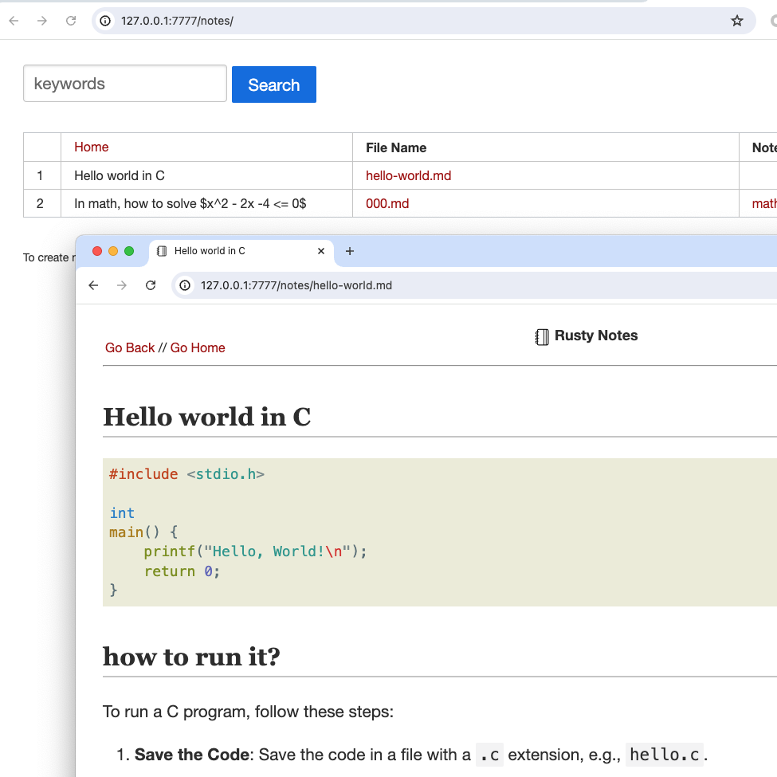

# Rusty Notes

A local simple **Markdown** web interface.



## Install & Setup

```
cargo install -f rusty-notes
```

## Run Server

```bash
export RUSTY_SERVER_ADDR=127.0.0.1:7777
export RUSTY_DIR_NOTES="$HOME/rusty-notes"
export RUSTY_DIR_TEMPLATES="$HOME/rusty-notes/static/templates"
nohup rusty-notes > /tmp/rusty-notes.log &
```
