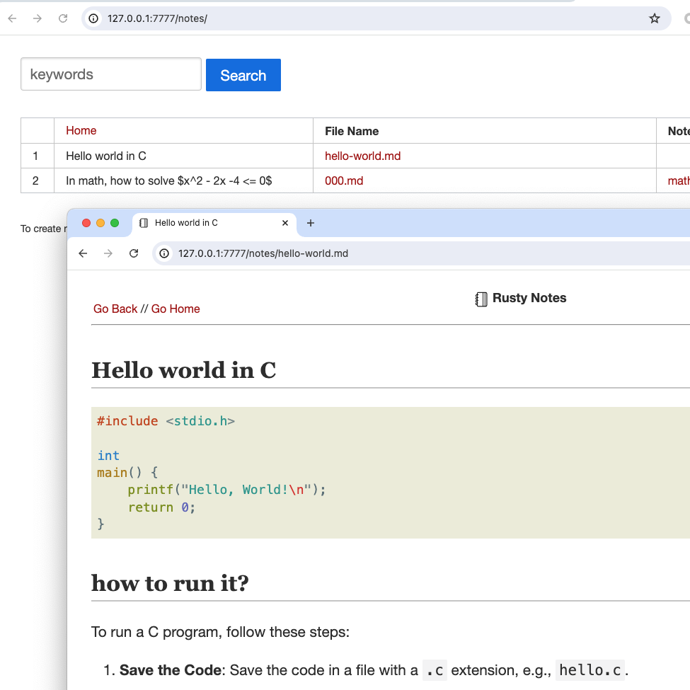

# Rusty Notes

[](https://crates.io/crates/rusty-notes)

A simple local Web-UI Notebook using Markdown.

## Install

```
$ cargo install -f rusty-notes
$ mkdir ~/rusty-notes
$ rusty-notes
```

The Web-UI will be at [http://127.0.0.1:7777/](http://127.0.0.1:7777/).

You can create notes from the Web-UI via the "Create a new note" link on the
home page, or simply add markdown files under the notes directory. Files are
placed by their path, e.g. `category/new-note.md`, and sub-directories are
treated as categories.

You can change the root directory, see "Run Server" section below.

## Run Server

```bash
export RUSTY_SERVER_ADDR=127.0.0.1:7777
export RUSTY_NOTES_DIR="$HOME/rusty-notes"
nohup rusty-notes > /tmp/rusty-notes.log &
```

The following environment variables are supported (with their defaults):
- `RUSTY_SERVER_ADDR`: the address to bind to (`127.0.0.1:7777`).
- `RUSTY_NOTES_DIR`: the notes root directory (`$HOME/rusty-notes`).
- `RUSTY_URL_PREFIX`: the URL path prefix the Web-UI is served under (`/`).
  For example, set it to `notes` to serve the UI at `http://127.0.0.1:7777/notes/`.
- `RUSTY_FONT_SIZE`: overrides the body base font size, as a float in `em`
  units (e.g. `1.0`). When unset, the default from `notes.css` (`1.2em`) is used.

## Customizing styles

The CSS shipped with rusty-notes (including `notes.css`) is embedded in the
binary, but you can override any of it without rebuilding. Drop your own file
under `$RUSTY_NOTES_DIR/static/css/` and it takes precedence over the embedded
copy. For example, to fully customize the styles, create:

```
$RUSTY_NOTES_DIR/static/css/notes.css
```

and it will be served at `/stc/css/notes.css` instead of the built-in one.

## Static files

Static files under `$RUSTY_NOTES_DIR/static/` can be access with URLs like:
- http://127.0.0.1:7777/stc/img/hello.png
  - for file: `static/img/hello.png`
- http://127.0.0.1:7777/code/2024/foo.c
  - for file: `static/code/2024/foo.c`

## What does it look like?



## Why is this useful?

So that you have a local Markdown notebook tracked and backed up with Git. And
simply run `rusty-notes` behind Nginx for a straightforward blogging system,
eliminating the need for a static HTML builder.
